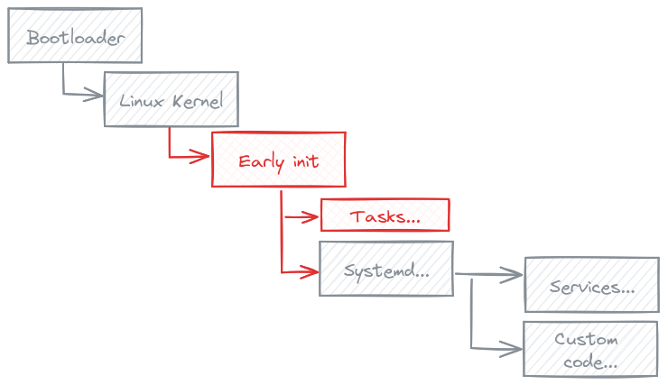

# early-init

Minimal init system to run tasks before the real init process start on embedded systems.

## License

MIT

Permission is hereby granted, free of charge, to any person obtaining a copy
of this software and associated documentation files (the "Software"), to deal
in the Software without restriction, including without limitation the rights
to use, copy, modify, merge, publish, distribute, sublicense, and/or sell
copies of the Software, and to permit persons to whom the Software is
furnished to do so, subject to the following conditions:

The above copyright notice and this permission notice shall be included in all
copies or substantial portions of the Software.

THE SOFTWARE IS PROVIDED "AS IS", WITHOUT WARRANTY OF ANY KIND, EXPRESS OR
IMPLIED, INCLUDING BUT NOT LIMITED TO THE WARRANTIES OF MERCHANTABILITY,
FITNESS FOR A PARTICULAR PURPOSE AND NONINFRINGEMENT. IN NO EVENT SHALL THE
AUTHORS OR COPYRIGHT HOLDERS BE LIABLE FOR ANY CLAIM, DAMAGES OR OTHER
LIABILITY, WHETHER IN AN ACTION OF CONTRACT, TORT OR OTHERWISE, ARISING FROM,
OUT OF OR IN CONNECTION WITH THE SOFTWARE OR THE USE OR OTHER DEALINGS IN THE
SOFTWARE.

## Authors

- Alexandre Grosset
- Christophe Blaess

## Summary

The aim of this small project is to easily run custom tasks during the boot of an embedded system before starting `systemd`, `sysvinit`, `openrc`, or any other init daemon.

The main idea is to divide the initialization tasks in two parts: the low-level tasks that need to be run at the very start of the boot, in a certain order, with a predictible behavior, and the high-level tasks that are needed to run custom code on the embedded system.

A fully predictible order of task execution is difficult to achieve with `systemd` for example, but `systemd` may be needed to run custom code with a lot of dependencies (D-bus...).

The idea is to let the kernel start `early-init` with the help of the `init=` directive of the kernel command line.
Then `early-init` executes in order the scripts found in `/etc/early-init.d`.
Finally `early-init` gives the control to the original `/sbin/init` process.



## Usage

Some command line options are available to configure `early-init`:

- The option `-v` (`--verbose`) let `early-init` display what it does on the standard error output.

- With the option `-n` (`--dry-run`), `early-init` doesn't run the scripts, only displays their names.

- The option `-i <filename>` (`--init <filename>`) allows `early-init` to execute an init process different than `/sbin/init` (for example `/bin/sh` for debug).

## Installation

In addition to installing `early-init` in `/sbin` directory and the scripts performing the desired tasks in `/etc/early-init.d`, you will need to add the `init=/sbin/early-init` argument on the kernel parameter line.

There is two ways to do this:

- configure the bootloader to pass this argument on the kernel command line (using `bootargs` variable for U-boot)
- configure the kernel himself to add the parameter on the command line.


The second way is much easier, as it only needs to configure three kernel options:

- `CONFIG_CMDLINE` must be filled with the string `"init=/sbin/early-init"`
- `CONFIG_CMDLINE_EXTEND` must be enabled (`y`)
- `CONFIG_CMDLINE_FROM_BOOTLOADER` has to be disabled.

We can achieve this with a simple kernel configuration fragment (present in `/cfg` subdirectory):

```
early-init-fragment.cfg: 

CONFIG_CMDLINE="init=/sbin/early-init"
CONFIG_CMDLINE_EXTEND=y
# CONFIG_CMDLINE_FROM_BOOTLOADER is not set
```


But this works only on some architectures (`arm`, `riscv`, `powerpc`...) but not on `arm64` for example.
So most of the time you will need to add the `init=` parameter from the bootloader configuration.

One possible way for U-boot is to add a `boot.cmd` file on the boot partition, containing at least this line:

```
setenv bootargs ${boootargs} init=/sbin/early-init
```

## Examples of use

There are some scripts provided as examples in `early-init.d` subdirectory:

- `010-mount-data-partition.sh` is a script to read/write mount a data partition, repariring the filesystem in case of mount error, and reformating the partition if the repair is not possible.
- `020-mount-overlayfs-on-etc.sh` allows to mount a (read/write) overlays on the (read-only) `/etc` directory. The configuration modifications will be stored on the `/data` partition.
- `030-system-time-from-rtc.sh` is a one-liner script to set the system date and time from the RTC.

Here are some other ideas of tasks that may need to be run as soon as possible at boot time and in a given order:

- loading needed kernel modules,
- reading a file in `/etc/` for parameters and setting network interfaces up,
- connecting to a remote NTP server and setting precise system time,
- ...

